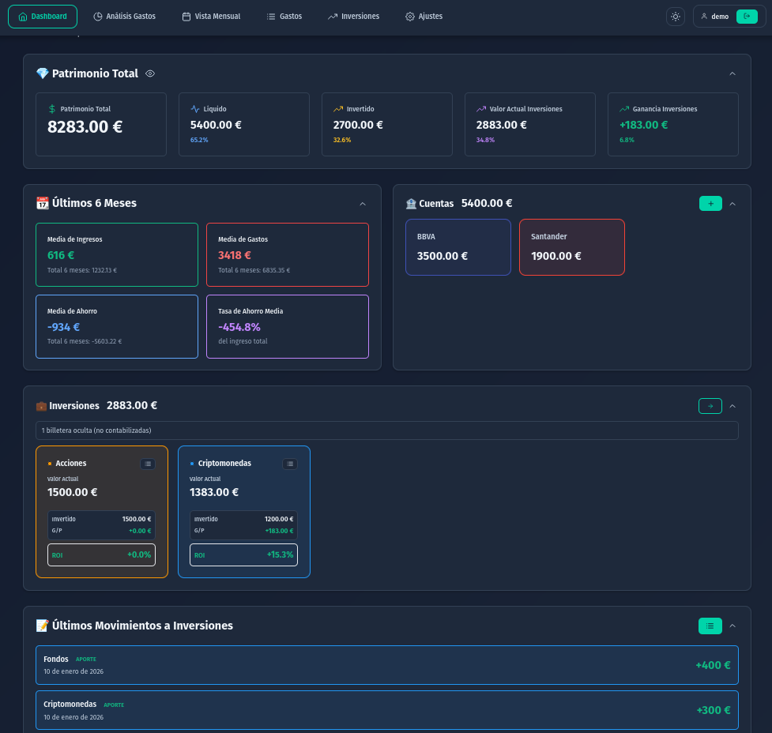
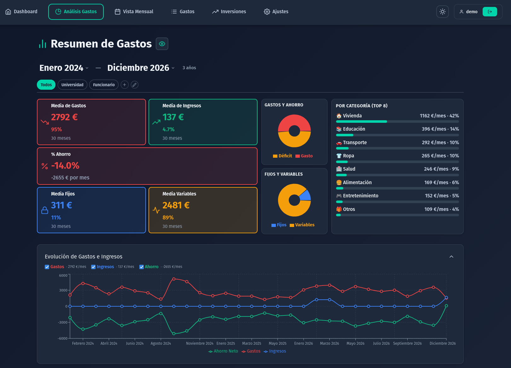
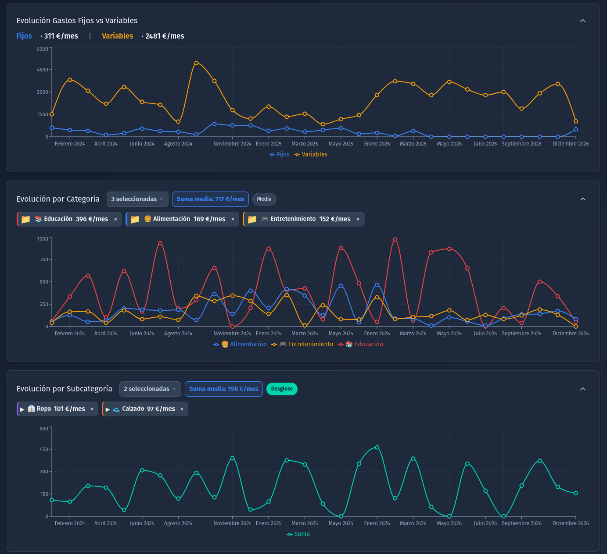
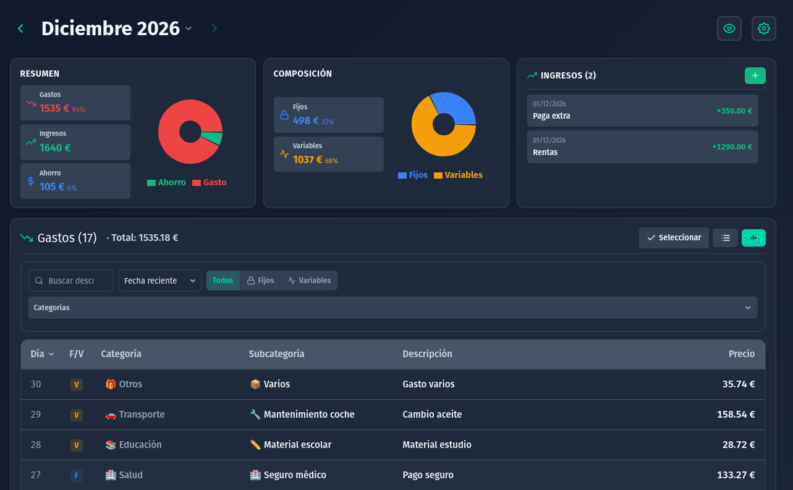
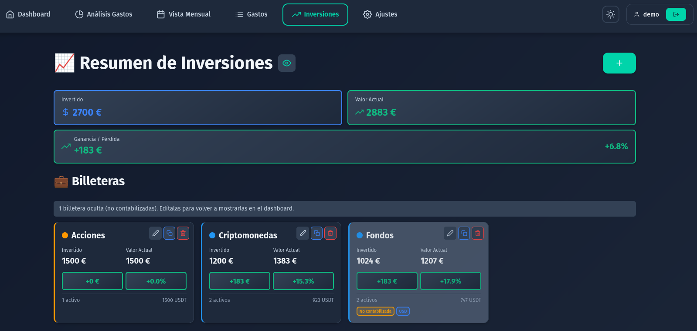
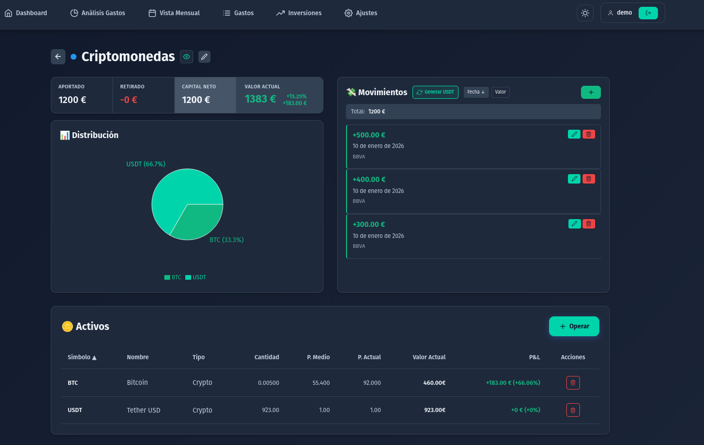
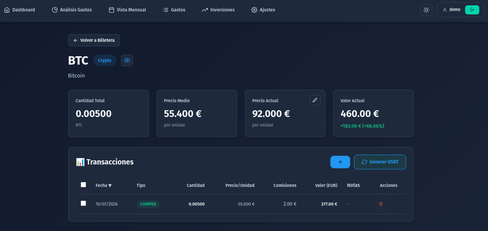
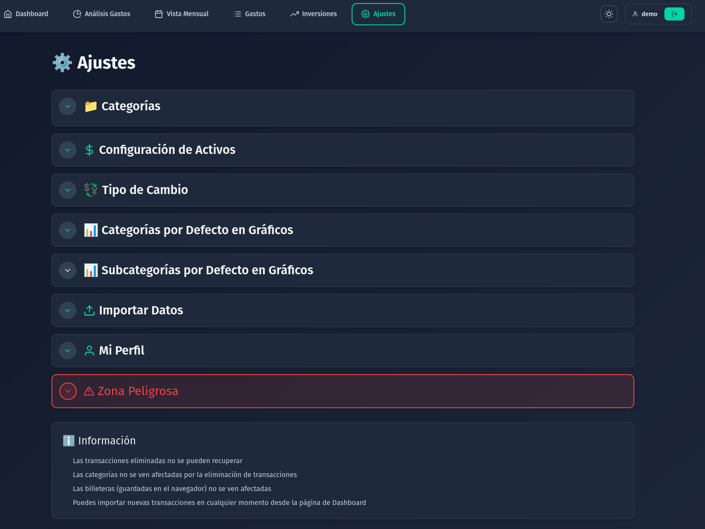

# 🚀 Expensivo - Docker Compose Setup

<div align="center">


**Despliegue rápido de Expensivo usando Docker Compose**

[](https://www.docker.com/)
[](https://www.postgresql.org/)
[](https://fastapi.tiangolo.com/)
[](https://nextjs.org/)

</div>

---

<div align="center">

## ⚠️ **ADVERTENCIA: APLICACIÓN BAJO DESARROLLO** ⚠️
### **¡Importante! Antes de cualquier cambio, realiza un respaldo de tus datos.**  
Puedes utilizar el comando `make backup` para crear una copia de seguridad rápida y sencilla.

</div>


## 📑 Índice

- [📖 Descripción del Proyecto](#-descripción-del-proyecto)
- [⚡ Inicio Rápido](#-inicio-rápido)
- [🏗️ Servicios Incluidos](#️-servicios-incluidos)
- [⚙️ Configuración](#️-configuración)
- [📚 Recursos](#-recursos)
- [📄 Licencia](#-licencia)
- [🤝 Contribuir](#-contribuir)


## 📖 Descripción del Proyecto

**Expensivo** es una aplicación web completa para la gestión de gastos personales y financieros. Este repositorio contiene la configuración de Docker Compose lista para usar, utilizando imágenes pre-construidas desde Docker Hub.

### ✨ Características Principales

- 💰 **Gestión de gastos e ingresos** - Registra y categoriza tus transacciones
- 📊 **Panel de control** - Visualiza tus finanzas con gráficos y estadísticas
- 🏦 **Múltiples cuentas bancarias** - Gestiona varias cuentas desde un solo lugar
- 📈 **Seguimiento de inversiones** - Controla tus activos y carteras
- 👤 **Gestión de usuarios** - Sistema de autenticación y roles

### 🖼️ Capturas de Pantalla

#### 1. 📊 Panel de control



El **panel de control** es tu centro financiero. Aquí puedes encontrar:
- 📂 **Resumen financiero** – Visualiza tu balance total y el desglose por categorías.
- 📊 **Estadísticas generales** – Consulta gastos e ingresos de los últimos 6 meses de forma visual.
- 🏦 **Cuentas bancarias** – Consulta el saldo de cada cuenta; actualízalo cuando lo necesites.
- 💼 **Cuentas de inversión** – Acceso directo a las secciones clave para gestionar inversiones.
- 🔄 **Movimientos entre cuentas** – Registra transferencias y movimientos de saldo hacia cuentas de inversión.

---

#### 2. 📋 Análisis de gastos



En **Análisis de gastos** ves el resumen del periodo elegido: totales, comparativa ingresos vs gastos y acceso a gráficos por categoría y tendencias.

*Continuación de la misma página (al hacer scroll):*



Más abajo en la misma página, la zona de **análisis detallado** muestra la evolución de gastos e ingresos, el desglose por categorías y datos útiles para tu gestión financiera.

---

#### 3. 📅 Vista mensual



En **Vista mensual** tienes todas las transacciones del mes en formato calendario: listado por días, filtros por categoría o tipo y opción de añadir o editar movimientos desde la misma vista.

---

#### 4. 💼 Inversiones



En **Inversiones** gestionas carteras y activos: balance por cartera, listado de posiciones (acciones, fondos, etc.) y visión del rendimiento de tus inversiones.

*Detalle de una cartera:*



*Detalle de un activo:*



---

#### 5. ⚙️ Ajustes



En **Ajustes** configuras perfil, categorías de gastos, cuentas bancarias, importación de datos (Excel/CSV) y opciones de seguridad (contraseña, etc.).

---

## ⚡ Inicio Rápido

### 1️⃣ Clonar el repositorio

```bash
git clone https://github.com/cmd69/expensivo.git
cd expensivo
```

### 2️⃣ Configurar variables de entorno

```bash
# Copiar el archivo de ejemplo
cp .env.example .env

# Editar con tus valores
nano .env  # o tu editor preferido
```

**🔑 Variables obligatorias:**

| Variable | Descripción | Cómo obtener |
|----------|-------------|--------------|
| `SECRET_KEY` | Clave secreta para JWT | `openssl rand -hex 32` |
| `ADMIN_USERNAME` | Usuario administrador | El que prefieras |
| `ADMIN_PASSWORD` | Contraseña del admin | Una segura |
| `POSTGRES_PASSWORD` | Contraseña de PostgreSQL | Una segura |

### 3️⃣ Iniciar los servicios

```bash
docker compose up -d

# O con Makefile
make up

# Ver los logs en tiempo real
make logs

# Verificar el estado
docker compose ps
```

**Backup antes de actualizar**: Antes de cada deploy, ejecuta `make backup-db` para crear un backup de la base de datos en `backups/`.

### 4️⃣ Acceder a la aplicación

| Servicio | URL | Descripción |
|----------|-----|-------------|
| 🌐 **Frontend** | http://localhost:3030 | Interfaz web principal |
| 🔌 **Backend API** | http://localhost:8008 | API REST |
| 📚 **API Docs** | http://localhost:8008/docs | Documentación interactiva |
| ❤️ **Health Check** | http://localhost:8008/health | Estado del servicio |

**¡Listo! 🎉** Ya puedes acceder a la aplicación.

---

## 🏗️ Servicios Incluidos

El `docker-compose.yml` despliega los siguientes servicios:

### 🔌 Backend API
- **Imagen**: `cmd69/expensivo-backend:latest`
- **Puerto**: 8008 (configurable)
- **Tecnología**: FastAPI (Python)
- **Características**:
  - ✅ API REST completa
  - ✅ Migraciones automáticas de base de datos
  - ✅ Health checks integrados
  - ✅ Documentación automática (Swagger/OpenAPI)

### 🎨 Frontend
- **Imagen**: `cmd69/expensivo-frontend:latest`
- **Puerto**: 3030 (configurable)
- **Tecnología**: Next.js (React/TypeScript)
- **Características**:
  - ✅ Interfaz moderna y responsive
  - ✅ Conexión automática al backend
  - ✅ Optimizado para producción

### 🐘 PostgreSQL
- **Imagen**: `postgres:15-alpine`
- **Puerto**: 5432 (configurable)
- **Características**:
  - ✅ Base de datos principal
  - ✅ Extensiones: uuid-ossp, pg_trgm
  - ✅ Datos persistentes
  - ✅ Health checks

### 📦 Redis
- **Imagen**: `redis:7-alpine`
- **Puerto**: 6379 (configurable)
- **Características**:
  - ✅ Cache y sesiones
  - ✅ Persistencia habilitada (AOF)
  - ✅ Health checks

---

## ⚙️ Configuración

### Variables de Entorno

Todas las variables están documentadas en `.env.example`. Las principales:

| Variable | Descripción | Default |
|----------|-------------|---------|
| `POSTGRES_USER` | Usuario de PostgreSQL | `expensivo_user` |
| `POSTGRES_PASSWORD` | Contraseña de PostgreSQL | - |
| `POSTGRES_DB` | Nombre de la base de datos | `expensivo_db` |
| `SECRET_KEY` | Clave secreta JWT | - |
| `ADMIN_USERNAME` | Usuario administrador | - |
| `ADMIN_PASSWORD` | Contraseña del admin | - |
| `CORS_ORIGINS` | Orígenes permitidos | `http://localhost:3030` |
| `BACKEND_PORT` | Puerto del backend | `8008` |
| `FRONTEND_PORT` | Puerto del frontend | `3030` |

### Cambiar puertos

Edita `.env` y modifica:
```env
BACKEND_PORT=8008
FRONTEND_PORT=3030
POSTGRES_PORT=5432
REDIS_PORT=6379
```

### Configurar CORS

Para permitir acceso desde otros dominios:
```env
CORS_ORIGINS=http://localhost:3030,https://tudominio.com
```

---

## 📚 Recursos

- [Documentación de Docker Compose](https://docs.docker.com/compose/)
- [Documentación de FastAPI](https://fastapi.tiangolo.com/)
- [Documentación de Next.js](https://nextjs.org/docs)
- [Documentación de PostgreSQL](https://www.postgresql.org/docs/)

---

## 📄 Licencia

Este repositorio contiene solo la configuración de despliegue.

---

## 🤝 Contribuir

Si encuentras algún problema o tienes sugerencias, por favor abre un issue en el repositorio.


