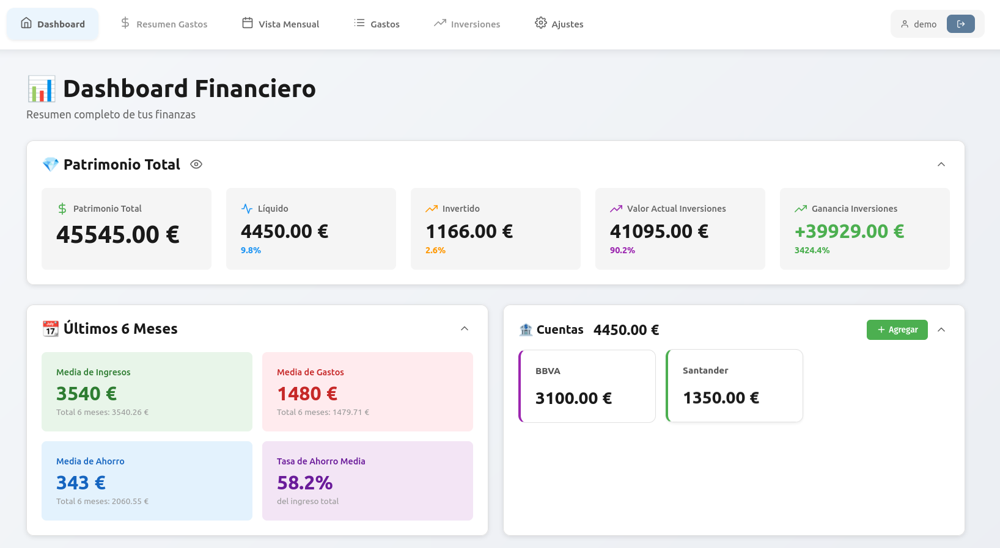
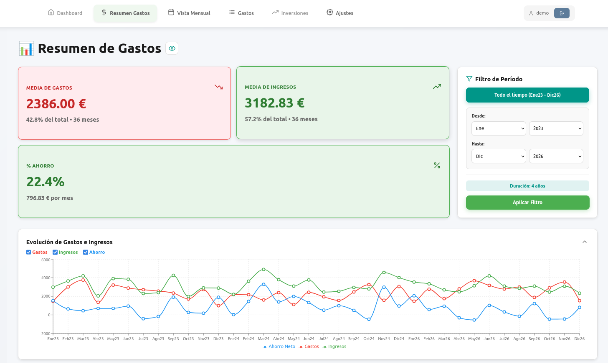
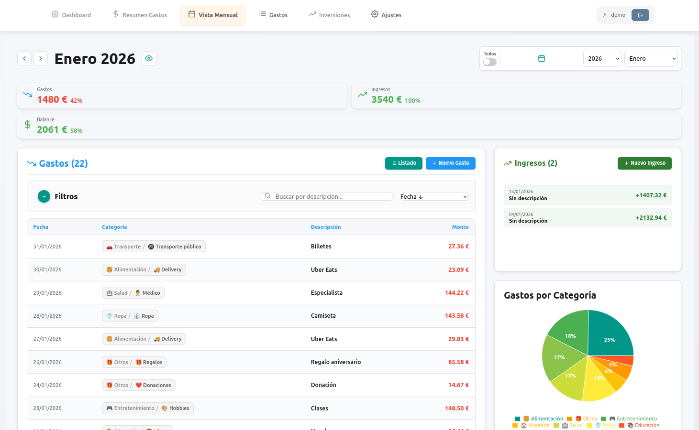
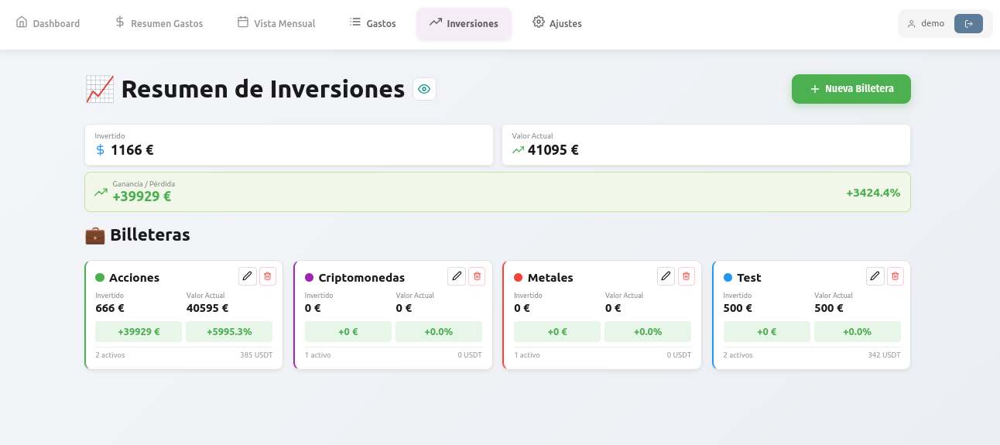
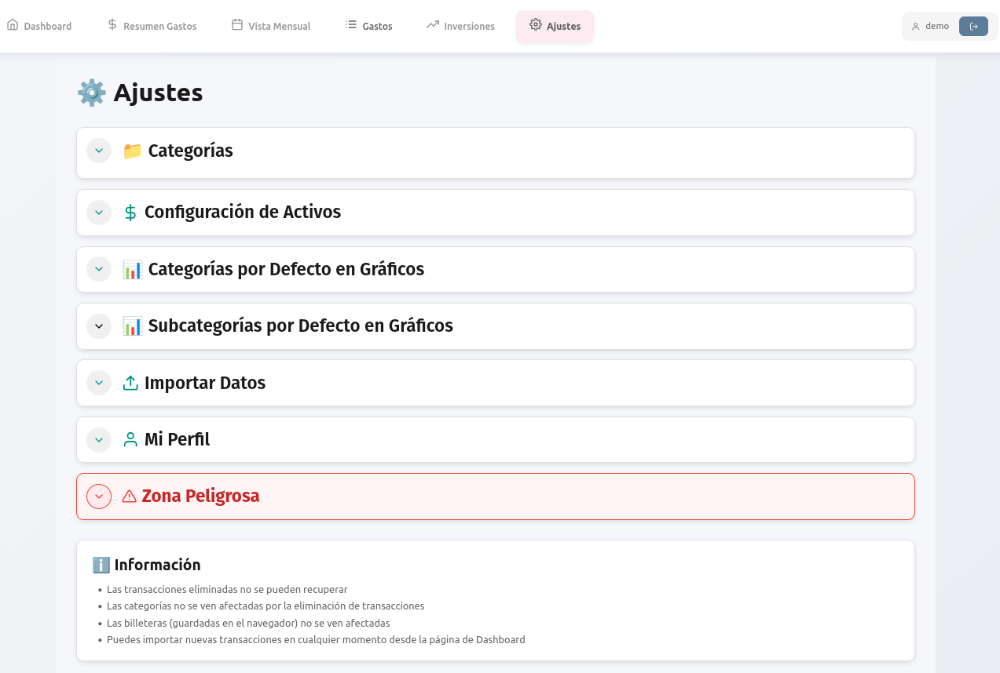

# 🚀 Expensivo - Docker Compose Setup

<div align="center">


**Despliegue rápido de Expensivo usando Docker Compose**

[](https://www.docker.com/)
[](https://www.postgresql.org/)
[](https://fastapi.tiangolo.com/)
[](https://nextjs.org/)

</div>

---

<div align="center">

## ⚠️ **ADVERTENCIA: APLICACIÓN BAJO DESARROLLO** ⚠️

</div>


## 📖 Descripción del Proyecto

**Expensivo** es una aplicación web completa para la gestión de gastos personales y financieros. Este repositorio contiene la configuración de Docker Compose lista para usar, utilizando imágenes pre-construidas desde Docker Hub.

### ✨ Características Principales

- 💰 **Gestión de gastos e ingresos** - Registra y categoriza tus transacciones
- 📊 **Dashboard interactivo** - Visualiza tus finanzas con gráficos y estadísticas
- 🏦 **Múltiples cuentas bancarias** - Gestiona varias cuentas desde un solo lugar
- 📈 **Seguimiento de inversiones** - Controla tus activos y carteras
- 👤 **Gestión de usuarios** - Sistema de autenticación y roles

### 🖼️ Capturas de Pantalla

#### 1. 📊 Dashboard



El **Dashboard** es tu centro de control financiero. Aquí puedes ver:
- 💰 **Resumen financiero** - Balance total, ingresos y gastos del mes
- 📈 **Gráficos interactivos** - Visualización de tus gastos por categoría
- 📅 **Actividad reciente** - Últimas transacciones registradas
- 🎯 **Vista rápida** - Acceso rápido a las secciones principales

---

#### 2. 📋 Summary (Resumen)



La vista de **Summary** te ofrece un análisis detallado de tus finanzas:
- 📊 **Estadísticas mensuales** - Comparación de ingresos vs gastos
- 🏷️ **Gastos por categoría** - Desglose visual de dónde va tu dinero
- 📈 **Tendencias** - Evolución de tus finanzas a lo largo del tiempo
- 💡 **Insights** - Información útil para mejorar tu gestión financiera

---

#### 3. 📅 Month View (Vista Mensual)



La **Vista Mensual** te permite ver todas tus transacciones organizadas por mes:
- 📆 **Calendario de transacciones** - Visualización día a día
- 🔍 **Filtros avanzados** - Busca por categoría, tipo o rango de fechas
- ➕ **Añadir transacciones** - Registra nuevos gastos o ingresos rápidamente
- 📝 **Edición rápida** - Modifica o elimina transacciones con un clic

---

#### 4. 💼 Investments (Inversiones)



La sección de **Inversiones** te ayuda a gestionar tu cartera:
- 💎 **Carteras de inversión** - Organiza tus activos en diferentes carteras
- 📊 **Seguimiento de activos** - Monitorea acciones, fondos y otros instrumentos
- 💰 **Balance de cartera** - Visualiza el valor total de tus inversiones
- 📈 **Rendimiento** - Analiza las ganancias y pérdidas de tus activos

---

#### 5. ⚙️ Settings (Ajustes)



En **Ajustes** puedes personalizar tu experiencia:
- 👤 **Perfil de usuario** - Gestiona tu información personal
- 🏷️ **Categorías** - Crea y organiza tus categorías de gastos
- 🏦 **Cuentas bancarias** - Administra tus cuentas y balances
- 📤 **Importar datos** - Importa transacciones desde Excel o CSV
- 🔐 **Seguridad** - Cambia tu contraseña y configuración de seguridad

---

## ⚡ Inicio Rápido

### 1️⃣ Clonar el repositorio

```bash
git clone https://github.com/cmd69/expensivo.git
cd expensivo
```

### 2️⃣ Configurar variables de entorno

```bash
# Copiar el archivo de ejemplo
cp .env.example .env

# Editar con tus valores
nano .env  # o tu editor preferido
```

**🔑 Variables obligatorias:**

| Variable | Descripción | Cómo obtener |
|----------|-------------|--------------|
| `SECRET_KEY` | Clave secreta para JWT | `openssl rand -hex 32` |
| `ADMIN_USERNAME` | Usuario administrador | El que prefieras |
| `ADMIN_PASSWORD` | Contraseña del admin | Una segura |
| `POSTGRES_PASSWORD` | Contraseña de PostgreSQL | Una segura |

### 3️⃣ Iniciar los servicios

```bash
# Iniciar todos los servicios en segundo plano
docker compose up -d

# Ver los logs en tiempo real
docker compose logs -f

# Verificar el estado
docker compose ps
```

### 4️⃣ Acceder a la aplicación

| Servicio | URL | Descripción |
|----------|-----|-------------|
| 🌐 **Frontend** | http://localhost:3030 | Interfaz web principal |
| 🔌 **Backend API** | http://localhost:8008 | API REST |
| 📚 **API Docs** | http://localhost:8008/docs | Documentación interactiva |
| ❤️ **Health Check** | http://localhost:8008/health | Estado del servicio |

**¡Listo! 🎉** Ya puedes acceder a la aplicación.

---

## 🏗️ Servicios Incluidos

Este docker-compose despliega los siguientes servicios:

### 🔌 Backend API
- **Imagen**: `cmd69/expensivo-backend:1.1.0`
- **Puerto**: 8008 (configurable)
- **Tecnología**: FastAPI (Python)
- **Características**:
  - ✅ API REST completa
  - ✅ Migraciones automáticas de base de datos
  - ✅ Health checks integrados
  - ✅ Documentación automática (Swagger/OpenAPI)

### 🎨 Frontend
- **Imagen**: `cmd69/expensivo-frontend:1.1.0`
- **Puerto**: 3030 (configurable)
- **Tecnología**: Next.js (React/TypeScript)
- **Características**:
  - ✅ Interfaz moderna y responsive
  - ✅ Conexión automática al backend
  - ✅ Optimizado para producción

### 🐘 PostgreSQL
- **Imagen**: `postgres:15-alpine`
- **Puerto**: 5432 (configurable)
- **Características**:
  - ✅ Base de datos principal
  - ✅ Extensiones: uuid-ossp, pg_trgm
  - ✅ Datos persistentes
  - ✅ Health checks

### 📦 Redis
- **Imagen**: `redis:7-alpine`
- **Puerto**: 6379 (configurable)
- **Características**:
  - ✅ Cache y sesiones
  - ✅ Persistencia habilitada (AOF)
  - ✅ Health checks

---

## ⚙️ Configuración

### Variables de Entorno

Todas las variables están documentadas en `.env.example`. Las principales:

| Variable | Descripción | Default |
|----------|-------------|---------|
| `POSTGRES_USER` | Usuario de PostgreSQL | `expensivo_user` |
| `POSTGRES_PASSWORD` | Contraseña de PostgreSQL | - |
| `POSTGRES_DB` | Nombre de la base de datos | `expensivo_db` |
| `SECRET_KEY` | Clave secreta JWT | - |
| `ADMIN_USERNAME` | Usuario administrador | - |
| `ADMIN_PASSWORD` | Contraseña del admin | - |
| `CORS_ORIGINS` | Orígenes permitidos | `http://localhost:3030` |
| `BACKEND_PORT` | Puerto del backend | `8008` |
| `FRONTEND_PORT` | Puerto del frontend | `3030` |

### Cambiar puertos

Edita `.env` y modifica:
```env
BACKEND_PORT=8008
FRONTEND_PORT=3030
POSTGRES_PORT=5432
REDIS_PORT=6379
```

### Configurar CORS

Para permitir acceso desde otros dominios:
```env
CORS_ORIGINS=http://localhost:3030,https://tudominio.com
```


---

## 📚 Recursos

- [Documentación de Docker Compose](https://docs.docker.com/compose/)
- [Documentación de FastAPI](https://fastapi.tiangolo.com/)
- [Documentación de Next.js](https://nextjs.org/docs)
- [Documentación de PostgreSQL](https://www.postgresql.org/docs/)

---

## 📄 Licencia

Este repositorio contiene solo la configuración de despliegue. Consulta la licencia del proyecto Expensivo para más información.

---

## 🤝 Contribuir

Si encuentras algún problema o tienes sugerencias, por favor abre un issue en el repositorio.


